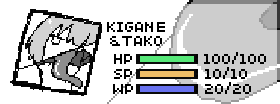

# マニュアル

## 基本操作
↑↓←→：十字キー　Z：決定　X：キャンセル
C：キャラクターチェンジ

## 戦闘画面について
### ステータス

HP：無くなると敗けます。
WP：魔法を使う際消費します。
SP：スタミナです。運動すると消費します。

### タイムライン

「技の発動」と「再行動」にかかる時間を表示しています。それぞれ濃い色、薄い色のアイコンが一番左に来たタイミング実行されます。

### コンボレベル

左上に表記されているのが現在コンボレベルです。  
現在コンボレベルより高い技は使用しても成功しません。  
コンボレベルが同じ技を使用するとコンボレベルが上がります。  
また、[Chain]の記載がある技はコンボレベルを維持出来ます。

### 射程と距離

敵と自分との距離は近、中、遠の3があり、技の射程に対応した距離に相手が居ないと攻撃が当たりません。

### Card

カードを消費して強力な技を使います。  
消費したカードは次のカード選択時に補填されます。

### Attack

基本的な攻撃技を使います。

### Action

基本的な非攻撃技を使います。

